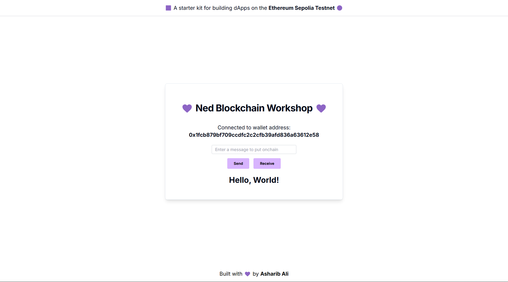

<h1 align="center">Ned Blockchain Workshop</h1>

***Context: I was invited to conduct a workshop for the students of NED University of Engineering and Technology on Blockchain. The topic was "Learn. Build. Ship. Your First dApp on Blockchain."***

A starter Kit template featuring **Nextjs & Hardhat**, designed for building `dApps`, as well as developing, deploying, and testing Solidity smart contracts on the Ethereum Sepolia Testnet. This starter kit includes pre-installed packages such as `create-next-app`, `hardhat`, `typescript`, `tailwindcss`, `shadcn-ui`, `web3.js`,  and more.

## 📺 Quickstart | Nextjs & Hardhat

### ⌛️ Clone the repository

Open up your terminal (or command prompt) and type the following command:

```sh
git clone https://github.com/asharibali/ned-blockchain-workshop.git

# cd into the directory
cd ned-blockchain-workshop
```

### 📜 Smart Contracts

All smart contracts are located inside the `backend` aka `hardhat` folder, which can be found in the root directory. To get started, first install the necessary dependencies by running:

```sh
# change directory into the backend folder
cd backend

npm install
```

### 🔑 Private key

Ensure you create a `.env` file in the `backend` directory. Then paste your [Metamask private key](https://metamask.zendesk.com/hc/en-us/articles/360015289632-How-to-export-an-account-s-private-key) in `.env` with the variable name `ACCOUNT_PRIVATE_KEY` as follows:

```sh
ACCOUNT_PRIVATE_KEY=0x734...
```

### ⚙️ Compile

Now, you can write your contracts in `./contracts/` directory, replace `Greeter.sol` with `<your-contracts>.sol` file.

```sh
# For compiling the smart contracts
npx hardhat compile
```

After successful compilation, the artifacts directory will be created in `./src` with a JSON `/contracts/<your-contracts>.sol/<your-contracts>.json` containing ABI and Bytecode of your compiled smart contracts.

### 🧪 Test

To write tests, go to `./test` directory and create `<your-contracts>.ts`, you can test your smart contracts using the following command.

```sh
# For testing the smart contracts
npx hardhat test
```


### ⛓️ Deploy

Before deploying the smart contracts, ensure that you have added the [`Ethereum Sepolia Testnet`](https://chainlist.org/chain/11155111) to your MetaMask wallet and that it has sufficient funds. If you do not have testnet $ETH on Ethereum Sepolia Testnet, please take some from this [faucet](https://cloud.google.com/application/web3/faucet/ethereum/sepolia).

Also, make changes in `./scripts/deploy.ts` (replace the greeter contract name with `<your-contract-name>`).

For deploying the smart contracts to `Ethereum Sepolia Testnet` network, type the following command:

```sh
# For deloying the smart contracts
npx hardhat run scripts/deploy.ts --network sepolia
```

```sh
<your-contract> deployed to: 0x...
```

## **Copy and paste the generated contract JSON ABI folder `contracts` inside the `backend/src/contracts` directory to the `/frontend/` directory.**

## **Copy and paste the deployed contract address [here](https://github.com/AsharibAli/ned-blockchain-workshop/blob/main/frontend/app/page.tsx#L37).**

### 💻 Next.js client

Start the Next.js app by running the following command in the `frontend` directory:

```sh
# Change directory into the frontend folder 
cd frontend

# Install dependencies
npm install

# Start the development server
npm run dev
```

<table align="center">
  <tr>
    <td align="center">
      
      <b>(/) Application Before State Update</b>
    </td>
    <td align="center">
      
      <b>(/) Application After State Update</b>
    </td>
  </tr>
</table>

<hr>

## 📝 Learning Resources

- [Blockchain Full Course - 6 hours | Blockchain Tutorial | 3 courses in 1](https://www.youtube.com/watch?v=6aF6p2VUORE)
- [Updraft Multiple Free Courses on Blockchain](https://updraft.cyfrin.io/courses)


## 🤝 Support

If you enjoy using this project, please show your support by starring the repository and follow me on [X](https://x.com/0xAsharib) & [LinkedIn](https://www.linkedin.com/in/asharibali/) for the latest updates and insights.

## ⚖️ License

This project is licensed under the [MIT License](https://github.com/asharibali/ned-blockchain-workshop/blob/main/LICENSE.md).
